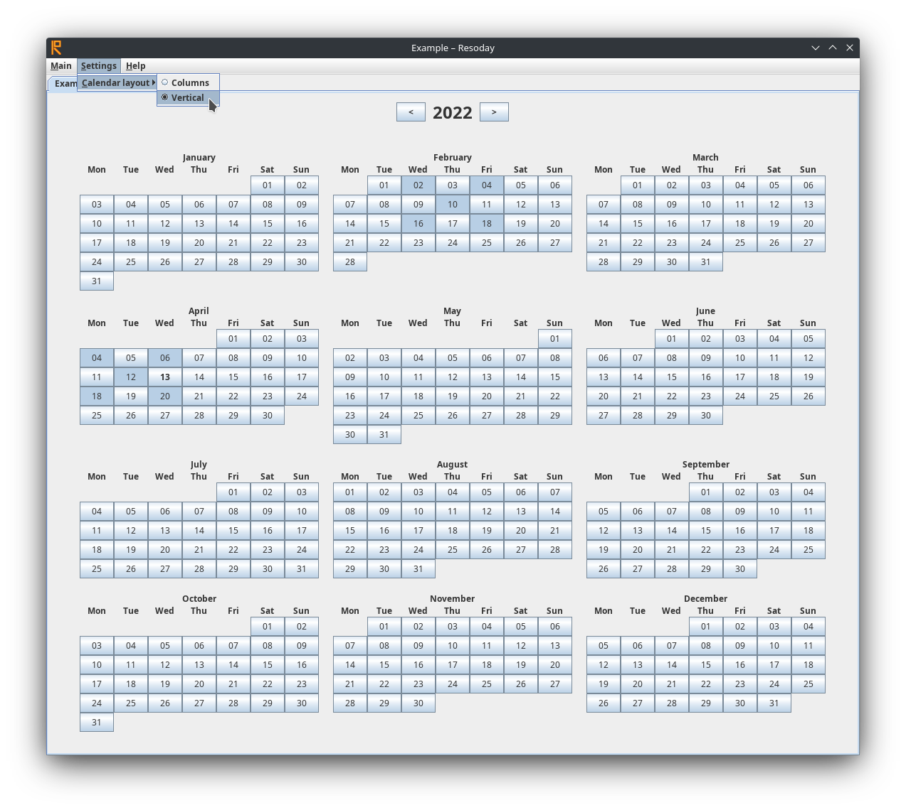

![Resoday icon][icon]

Resoday – habit tracking calendar
=================================

Resoday allows tracking habits, chores, and other activities on a daily
calendar. This application emulates the [Every Day Calendar][Simone] by Simone
Giertz, which is shown in [video _Why Most Resolutions Fail &amp; How To
Succeed_][Veritasium] by Veritasium.

Examples
--------

Resoday helps answer the questions like the following:

- When was the last time I did laundry?
- Did I take vitamins today?
- How often do I journal?

Examples of what you can keep track of using Resoday:

- Fitness and physical exercise
- Housekeeping chores: cleaning the floor, doing laundry, etc)
- Hardware maintenance: changing the oil, recharging batteries, etc)
- Mental health exercises:
  - Journaling
  - Meditation
- Studying: homework, revision, etc

Usage
-----

Download `resoday-release.jar` from [releases tab on GitLab][GitLabReleases] or
[GitHub][GitHubReleases] and launch it. If your Java installation is not
integrated into operating system and/or desktop environment to automatically
launch `*.jar` files, use:

    $ java -jar resoday-release.jar

Requires Java 17 or newer.

Building
--------

Run in a terminal:

    $ ./gradlew clean release

After that, you can launch Resoday from file `build/distributions/resoday-release.jar`.

License
-------

Resoday source code is distributed under GNU General Public License version 3.
See `LICENSE.txt` for details.

TODO
----
[TODO list in Taskell (Markdown-like) format][TODO]

[icon]: src/main/resources/dev/andrybak/resoday/gui/resoday-icon-64px.png
[Simone]: http://www.simonegiertz.com/every-day-calendar
[Veritasium]: https://www.youtube.com/watch?v=Pm9CQn07OjU&t=4m26s
[TODO]: https://github.com/rybak/resoday/blob/todo/TODO.md
[GitLabReleases]: https://gitlab.com/andrybak/resoday/-/releases
[GitHubReleases]: https://github.com/rybak/resoday/releases
